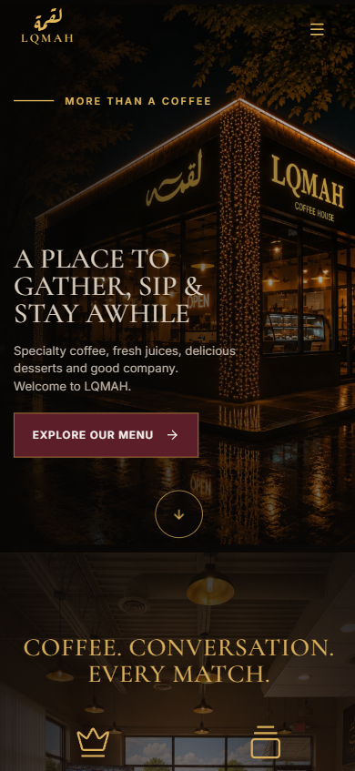
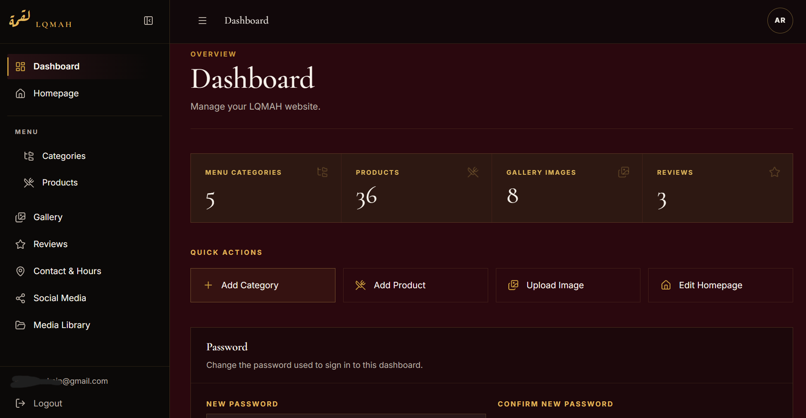

# LQMAH Café ☕

A full-stack web experience with a custom content management system, built for a real café business.

🌐 **Live Website:** https://lqmah-cafe.vercel.app

---

## ✦ About the Project

LQMAH is a real client project built to give the café a modern online presence while making day-to-day website management simple.

Instead of creating only a static website, I built a custom administration system that allows website content to be managed without editing the code.

I handled the design, development, database integration, admin experience, and deployment.

---

## ✦ Features

### Customer Website

- Responsive café website
- Dynamic homepage content
- Menu presentation
- Gallery
- Customer reviews
- Contact information
- Mobile-friendly interface

The customer-facing experience was designed to work across desktop and mobile devices.



### Custom Admin Dashboard

The project includes a custom administrative dashboard for managing website content.



Administrators can manage:

- Homepage content
- Menu categories and products
- Gallery content and media
- Customer reviews
- Contact information and business hours
- Social media links
- Administrative access

Changes made through the dashboard are stored in the database and reflected on the website.

---

## ✦ Tech Stack

**Frontend**
- Next.js
- React
- TypeScript
- CSS

**Backend & Database**
- Supabase
- PostgreSQL
- Row Level Security (RLS)

**Development & Deployment**
- Git
- GitHub
- Vercel

---

## ✦ Architecture

The public website and administrative dashboard share a Supabase-backed content management system.

```text
                    LQMAH
                      │
          ┌───────────┴───────────┐
          │                       │
    Public Website          Admin Dashboard
          │                       │
          └───────────┬───────────┘
                      │
                   Next.js
                      │
                   Supabase
                 ┌────┴────┐
                 │         │
            PostgreSQL    Auth
                 │
                RLS
```

---

## ✦ Security

The project uses Supabase Row Level Security policies to control access to database resources.

Environment-specific credentials are kept outside the repository using environment variables.

The application separates browser-side and server-side Supabase access where appropriate.

> Sensitive credentials and production secrets are not stored in this repository.

---

## ✦ What I Built

This project gave me hands-on experience across the full lifecycle of a web application:

- Designing the user experience
- Building reusable frontend components
- Creating a custom CMS
- Designing database-backed content
- Implementing administrative functionality
- Working with authentication and access controls
- Configuring Supabase Row Level Security
- Managing environment variables
- Deploying and maintaining a production application

---

## ✦ Project Status

🟡 **In Active Development**

LQMAH is live and functional, but I'm still improving and expanding parts of the project.

The menu experience in particular is still being developed and refined, along with smaller UI and content improvements throughout the site.

The current deployment represents the latest working version, not the final product.

---

## ✦ Local Development

Clone the repository and install the dependencies:

```bash
npm install
```

Start the development server:

```bash
npm run dev
```

Create a `.env.local` file using `.env.example` as a reference for the required environment variables.

Never commit production secrets or service-role credentials to the repository.

---

## ✦ Credits

Designed and developed by **Safa Qasem**.

Built as a client project under **ArtiCode**.
